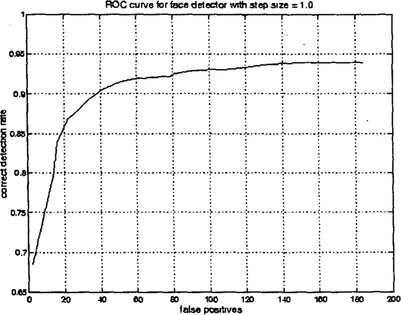

## mipt-projet

A computer vision application based in openCV with the algorithm haar-cascades

# Theory

Object Detection using Haar feature-based cascade classifiers is an effective object detection method proposed by Paul Viola and Michael Jones in their paper, "Rapid Object Detection using a Boosted Cascade of Simple Features" in 2001. It is a machine learning based approach where a cascade function is trained from a lot of positive and negative images. It is then used to detect objects in other images.

Here we will work with face detection. Initially, the algorithm needs a lot of positive images (images of faces) and negative images (images without faces) to train the classifier. Then we need to extract features from it. For this, Haar features shown in the below image are used. They are just like our convolutional kernel. Each feature is a single value obtained by subtracting sum of pixels under the white rectangle from sum of pixels under the black rectangle.

# Compute Imagem

Rectangle features can be computed very rapidly using an intermediate representation for the image which we call the integral image. The integral image at location x,y contains the sum of the pixels above and to the left of x,y, inclusive:

# Conclusion
.gif)

# References

1. Paul Viola and Michael J. Jones. Robust real-time face detection. International Journal of Computer Vision, 57(2):137–154, 2004. [224]
2. Rainer Lienhart and Jochen Maydt. An extended set of haar-like features for rapid object detection. In Image Processing. 2002. Proceedings. 2002 International Conference on, volume 1, pages I–900. IEEE, 2002. [132]
